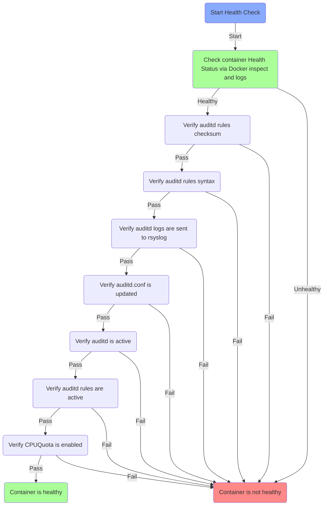

```mermaid
flowchart
    id_health(Start Health Check)
    style id_health fill:#8AF
    id_container(Check container Health Status via Docker inspect and logs)
    style id_container fill:#AF9
    id_checksum(Verify auditd rules checksum)
    id_syntax(Verify auditd rules syntax)
    id_logs(Verify auditd logs are sent to rsyslog)
    id_conf(Verify auditd.conf is updated)
    id_auditd_active(Verify auditd is active)
    id_rules_active(Verify auditd rules are active)
    id_cpuquota(Verify CPUQuota is enabled)
    id_container_healthy(Container is healthy)
    style id_container_healthy fill:#AF9
    id_container_not_healthy(Container is not healthy)
    style id_container_not_healthy fill:#F88

    id_health -->|Start| id_container
    id_container -->|Healthy| id_checksum
    id_container -->|Unhealthy| id_container_not_healthy
    id_checksum -->|Pass| id_syntax
    id_checksum -->|Fail| id_container_not_healthy
    id_syntax -->|Pass| id_logs
    id_syntax -->|Fail| id_container_not_healthy
    id_logs -->|Pass| id_conf
    id_logs -->|Fail| id_container_not_healthy
    id_conf -->|Pass| id_auditd_active
    id_conf -->|Fail| id_container_not_healthy
    id_auditd_active -->|Pass| id_rules_active
    id_auditd_active -->|Fail| id_container_not_healthy
    id_rules_active -->|Pass| id_cpuquota
    id_rules_active -->|Fail| id_container_not_healthy
    id_cpuquota -->|Pass| id_container_healthy
    id_cpuquota -->|Fail| id_container_not_healthy
```
