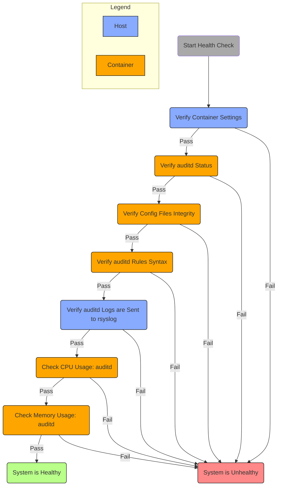

```mermaid
flowchart
    id_health(Start Health Check)
    style id_health fill:#A9A9A9
    id_container(Verify Container Settings)
    style id_container fill:#8AF,stroke:#000
    id_process(Verify auditd Status)
    style id_process fill:#FFA500,stroke:#000
    id_conf(Verify Config Files Integrity)
    style id_conf fill:#FFA500,stroke:#000
    id_syntax(Verify auditd Rules Syntax)
    style id_syntax fill:#FFA500,stroke:#000
    id_logs(Verify auditd Logs are Sent to rsyslog)
    style id_logs fill:#8AF,stroke:#000
    id_cpu(Check CPU Usage: auditd)
    style id_cpu fill:#FFA500,stroke:#000
    id_mem(Check Memory Usage: auditd)
    style id_mem fill:#FFA500,stroke:#000
    id_healthy(System is Healthy)
    style id_healthy fill:#b9ff8a,stroke:#000
    id_not_healthy(System is Unhealthy)
    style id_not_healthy fill:#F88,stroke:#000

    id_health --> id_container
    id_container -->|Pass| id_process
    id_container -->|Fail| id_not_healthy
    id_process -->|Pass| id_conf
    id_process -->|Fail| id_not_healthy
    id_conf -->|Pass| id_syntax
    id_conf -->|Fail| id_not_healthy
    id_syntax -->|Pass| id_logs
    id_syntax -->|Fail| id_not_healthy
    id_logs -->|Pass| id_cpu
    id_logs -->|Fail| id_not_healthy
    id_cpu -->|Pass| id_mem
    id_cpu -->|Fail| id_not_healthy
    id_mem -->|Pass| id_healthy
    id_mem -->|Fail| id_not_healthy

    subgraph Legend
        direction LR
        A[Host]
        style A fill:#8AF,stroke:#000
        C[Container]
        style C fill:#FFA500,stroke:#000
    end
```
